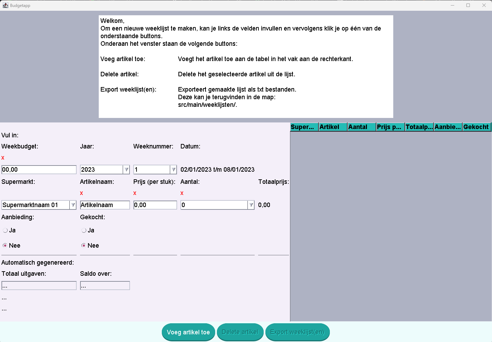
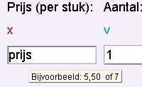
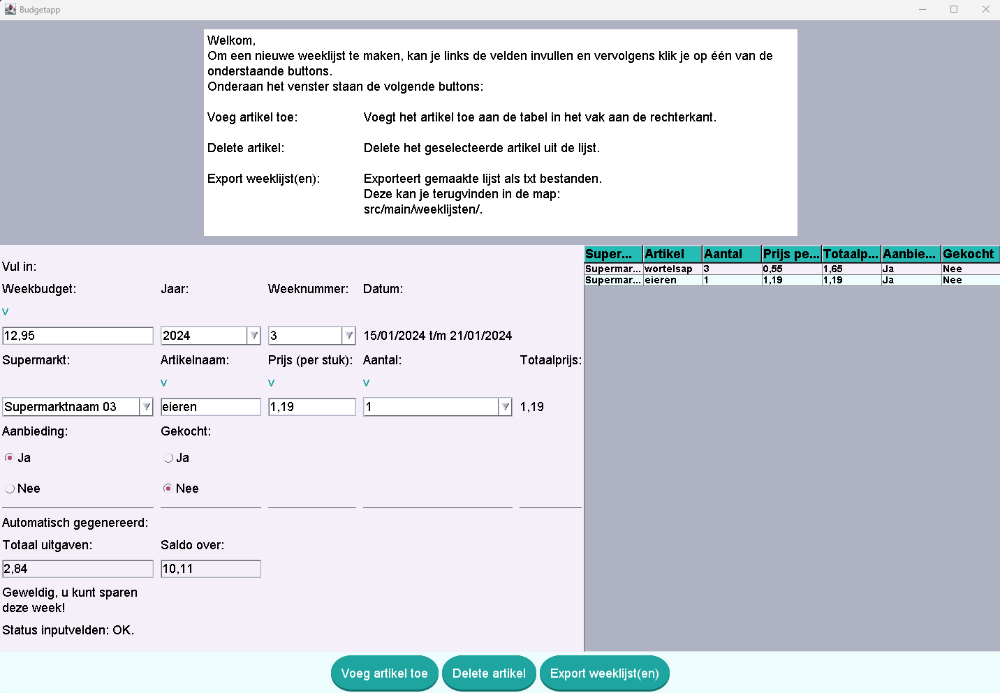
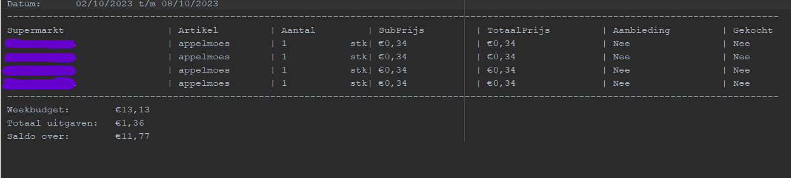
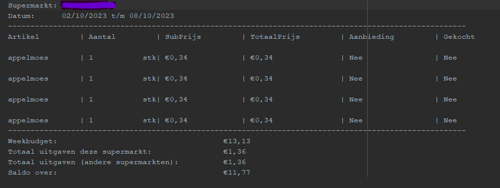

# Welcome

This Github repo contains a selection of my work
including the following softwaredevelopment 
languages:

1. Java
2. Javascript
   - Datavisualisation [example](https://tekkatan.github.io/portfolio/datavisuals.html)
   - Animation
4. Python 

Note:
- If you are using any of my code, please add a link to me/my website/ or **this** github repo. Thumbs up for the supporting devs 


# Java Projects
## 1. [BudgetApp](https://github.com/tekkatan/portfoliowork/tree/main/javaprojects/budgetapp "goto java BudgetApp project")

### Info
- The BudgetApp is a CRUD App made with Java OpenJDK 8 and the Swing library
- This App is made as a moduleassingment of module Designing and Programming (Ontwerpen en Programmeren) for my
  education HBO Software Development.
- To prevent any copyright issues, the supermarketnames have been changed to 
  supermarktnaam 01, 02, etc in this online version.

### Usage - Creating and adding articles
- The User starts at the screen below where he/she can fill in the fields.


- The program will inform the User about any errors like in the examples below.
- The first example is of informing the User about an error in a field when he or she
  wants to add an article to the grocerylist. The field itself will also have an "X" instead of a "V" until the error is fixed.

 - BudgetApp")
- Error example of onhover hinting and icons



- The program will inform the User about his/her planned expenses and whether there is
  room to save some money in the chosen weekyear.



### Usage - Deleting articles
- The User can delete articles by first clicking on the row in the grocerylist and then 
  click on the button delete.

### Usage - Exporting grocerylist
- When the User is satisfied with their list he or she can export the list to .txt format.
- Per export an overview list of all supermarkets and a detailed list per supermarket will be made.
  For this example the User has chosen to only buy appelmoes at one supermarket resulting
  in an overview list with one supermarketname and a similar detailed list of the chosen supermarket.
- Again in order to prevent any copyright issues, the supermarketname has been made
  unreadable.

- Overview of expenses for the chosen weekyear date


- Detailed overview of expenses at a specific supermarket


## 2. [RegexIBAN Project](https://github.com/tekkatan/portfoliowork/tree/main/javaprojects/regexIBAN "goto java RegexIBAN Project")

### Info
- A small simple program which searches a Dutch IBAN in a String or a txt File.
- As the title of this project already shows, this program relies on the use of Regex patterns.

### Usage
- In the main method below I've written two examples of how one can
  search for Dutch IBAN in both text files as well as in Strings.

```java

    public static void main(String[] args) {
        try{
            // Search Dutch IBAN in String text
            String nlIBAN="NL23ABNB9933445566";
            String nlIBANwithSpaces="NL23ABNB 9933 4455 66";
            searchIBAN_In_Text(nlIBAN);
            searchIBAN_In_Text(nlIBANwithSpaces);

            // Search Dutch IBAN in file text
            String relPathToFile="src/main/resources/order.txt";
            searchIBAN_In_TextFile(relPathToFile);
        }catch (Exception ex){
            ex.printStackTrace();
        }
    }

```

- Contains a method for converting a relative filepath into an absolute filepath.

**Source: method for converting a relative filepath into an absolute filepath**
```java

    public static Path getAbsolutePath_FromRelativePath(String fileRelativePath){
        /*
        Method for converting a relative filepath into an absolute filepath
         */
        String file=new File(fileRelativePath).getAbsolutePath();
        return Paths.get(file);
    }

```
- Contains a method for searching and extracting a Dutch IBAN inside of a txt file by using a BufferedReader and
  a regex pattern that allows for the swift guideline spaces.
  The regex searches for the title IBAN: and the actual IBAN value.

**Source: method for extracting a Dutch IBAN inside of a txt file**
```java

     public static void searchIBAN_In_TextFile(String file){
        /*
          Method for searching and extracting a Dutch IBAN inside of a txt file by using a BufferedReader and
          a regex pattern that allows for the swift guideline spaces.
          The regex searches for the title IBAN: and the actual IBAN value
         */
        // Get the absolute path
        Path absPathToFile=getAbsolutePath_FromRelativePath(file);
        // Search the file in the absolute path
        try(BufferedReader br= Files.newBufferedReader(absPathToFile)){
            // Search for Dutch IBAN
            // Allows for spaces before every numberblock of iban
            String searchREGEX="^IBAN:\\s*([A-Z]{2})([0-9]{2})([A-Z]{4})(\\s*[0-9]{4}\\s*[0-9]{4}\\s*[0-9]{2})$";
            Pattern pattern= Pattern.compile(searchREGEX);
            String line=br.readLine();
            while(line!=null){
                Matcher m=pattern.matcher(line);
                if(m.find()){
                    String countryCode=m.group(1);
                    String countryCheckCode=m.group(2);
                    String bankCode=m.group(3);
                    String bankAccountNumber=m.group(4);
                    System.out.println("Countrycode is: "+countryCode);
                    System.out.println("Country checkcode is: "+countryCheckCode);
                    System.out.println("BankCode is: "+bankCode);
                    System.out.println("Bankaccount number is: "+bankAccountNumber);
                }
                line=br.readLine();
            }
        }catch (IOException ex){
            ex.printStackTrace();
        }
    }

```
- Contains a method for searching a Dutch IBAN inside of a String by using a simple regex pattern that only searches
  for the actual IBAN number.

**Source: method for extracting a Dutch IBAN inside a String**
```java

    public static void searchIBAN_In_Text(String dummyIBAN){
        // Search for Dutch IBAN
        // Allows for space before every number
        String searchREGEX="^[A-Z]{2}[0-9]{2}[A-Z]{4}\\s*[0-9]{4}\\s*[0-9]{4}\\s*[0-9]{2}$";
        try{
            Pattern p= Pattern.compile(searchREGEX);
            if(dummyIBAN==null){
                return;
            }
            Matcher m=p.matcher(dummyIBAN);
            if(m.matches()){
                System.out.println("IBAN found");
                // removes all whitespaces from IBAN
                String removePattern=dummyIBAN.replaceAll("\\s","");
                System.out.println(removePattern);
            }else{
                System.out.println("No IBAN found");
            }
        }catch(Exception ex){
            ex.printStackTrace();
        }
    }

```


## 3. [Playwright simple test](https://github.com/tekkatan/portfoliowork/tree/main/javaprojects/playwright "goto java Playwright simple test project")

### Info
- A small simple test using the Playwright and JUnit library for searching the word "wortelsap" on wikipedia.

**Source: Test with Playwright and JUnit**
```java
   
   public class TestExample {
    // Shared between all tests in this class
    static Playwright playwright;
    static Browser browser;

    // New instance for each test method
    BrowserContext context;
    Page page;

    @BeforeAll
    static void launchBrowser(){
        playwright = Playwright.create();
        browser = playwright.chromium().launch();
    }
    @AfterAll
    static void closeBrowser(){
        playwright.close();
    }

    @BeforeEach
    void createContextAndPage(){
        context=browser.newContext();
        page=context.newPage();
    }
    @AfterEach
    void closeContext(){
        context.close();
    }

    @Test
    void shouldSearchWiki(){
        page.navigate("https://wikipedia.org/");
        page.locator("input[name=\"search\"]").click();
        page.locator("input[name=\"search\"]").fill("wortelsap");
        page.locator("input[name=\"search\"]").press("Enter");
        assertEquals("https://nl.wikipedia.org/w/index.php?go=Go&search=wortelsap&title=Speciaal:Zoeken&ns0=1",
                page.url());
    }
}

```


## 4. [BinaryCalc](https://github.com/tekkatan/portfoliowork/tree/main/javaprojects/binarycalc "goto java binary calc project")

### Usage
- Binary functions for common mathematical use
- This class does not use the ++ or -- arithmetic operators
- Why using this way? 
- Well because it can be used in all OOP languages
      And it explains the algorithm of Binary thinking in
      an usefull way.
- Using this in multithreaded programs is discouraged

**Example**
- Make sure to include the BinaryFunctions class in your project appropiate folder

- The following testcases examples are written using
junit5 via mvn. See the [pom file](https://github.com/tekkatan/portfoliowork/tree/main/javaprojects/binarycalc "goto map with pom file") for more info.

All test cases are tested on:
1. Usage of method in general
2. Usage of method with zero values and that
   it handles this correctly.
3. Note the `BeforeEach` to setup in the testfile. Do not delete this otherwise the source class won't be initialized before testing it.

**Source: Calculating SQRT in a Binary way**
```java
public int sqrt(int n){
        // only non-negative input
        // Binary numeral system base 2
        int x=n;
        int c=0;
        // int is32bits, d starts at the highest power of 4
        // d=1<<30 will shift the second to top bit,
        // same as writing (maxInt)+1/2 = 1073741824
        try{
            int d=1<<30; 
            //System.out.println("d=1<<30 outputs: "+d); //1073741824
            // as long as d is bigger than n
            while(d>n){
                d>>=2;
            }
            //System.out.println("while (d>n) d>>=2 output: "+d); //16
            while(d!=0){
                if(x>=increment(c,d)){
                    x=x-increment(c, d);
                    c=c>>1;
                    c=increment(c, d);
                }
                else{
                    c>>=1;
                }
                d>>=2;
            }
            //return c;
        }catch(Exception e){
            e.printStackTrace();
        }
        return c;
        
    }

```


**TestCase**
```java 
 BinaryFunctions bFunctions;

    @BeforeEach
    void setup(){
        bFunctions=new BinaryFunctions();
    }
    // Tests for SQRT method
    @Test
    @DisplayName("Simple example of getting sqrt")
    public void testSqrt()
    {
        assertEquals(5,bFunctions.sqrt(25),
            "Regular sqrt should work");
    }
    @RepeatedTest(2)
    @DisplayName("Ensure that it can handle zero correctly")
    void testSQRTWithZeroValue(){
        assertEquals(0,bFunctions.sqrt(0),
        "The sqrt of 0 should be 0");
    }

```
**Source: Calculating Modulo in a Binary way**
```java
 public int modulo(int x,int y){
        try{
            while(x>y){
                x=(x&y)+(x>>3);
            }
            return (x==y)?0:x;
        }
        catch(Exception e){
            e.printStackTrace();
        }
        return (x==y)?0:x;
    }

```
**TestCase**
```java
// Modulo
    @Test
    @DisplayName("Simple test of modulo")
    public void testModulo(){
        assertEquals(3,bFunctions.modulo(3, 7),
            "Regular 3%7");
    }
    @RepeatedTest(2)
    @DisplayName("Ensure that it can handle zero correctly")
    public void testModuloWithZeroValue(){
        assertEquals(0,bFunctions.modulo(0, 0),
            "Modulo of 0 % 0");
        assertEquals(0,bFunctions.modulo(3, 0),
            "Modulo of 3 % 0");
        assertEquals(0,bFunctions.modulo(0, 3),
            "Modulo of 0 % 3");
    }
```

**Source: Calculating Increment in a Binary way**

```java
public int increment(int x, int y){
        try{
            while(y!=0){
                int  bucket=x&y;
                x=x^y;
                y=bucket<<1;
            }
            return x;
        }
        catch(Exception e){
            e.printStackTrace();
        }
        return x;
    }
```
**TestCase**
```java
// Increment
    @Test
    @DisplayName("Simple test of increment")
    public void testIncrement(){
        assertEquals(4,bFunctions.increment(3, 1),
            "Regular 3+1");
    }
    @RepeatedTest(2)
    @DisplayName("Ensure that it can handle zero correctly")
    public void testIncrementWithZeroValue(){
        assertEquals(0,bFunctions.increment(0, 0),
            "increment of 0 + 0");
        assertEquals(3,bFunctions.increment(3, 0),
            "increment of 3 + 0");
        assertEquals(3,bFunctions.increment(0, 3),
            "increment of 0 + 3");
    }
```


## 5. [CalcLambda](https://github.com/tekkatan/portfoliowork/tree/main/javaprojects/calclambda "goto java calc lambda project")

### Usage
- This Project uses an
Interface > enum > abstract class > executing class structure.
- The executing class is
OperationLambValues. This class contains junit testcases.
- All test cases are tested for:
 1. double types
 2. arrays of ints
 3. arrays of doubles
 4. values starting from zero
 5. values starting from a different numberic value

**Example**: 
adding two numbers

```java
// Using zero as startvalue
// Add two numbers
@Test
	public void calcWhenUsingSelfmadeEnumNul() {
		OperationLambValues op=new OperationLambValues();
		double result=op.calculate(0, 3, 1, OperationLamb.valueOf("ADD"));
		assertEquals(4.0,result,4.0);
	}

```
**Example 2**: 
Subtract two numbers

```java
// Using zero as startvalue
// Subtract an array of doubles
	@Test
	public void calcWhenSumUsingSelfMadeEnumNulSubdbl() {
		OperationLambValues op=new OperationLambValues();
		double []a= {2.0,3.0,5.0};
		double result=op.calcsumArraydbl(0.0, a, OperationLamb.valueOf("SUBTRACT"));
		assertEquals(-10.0,result,-10.0);
	}

```

## 6. [CSVReaders](https://github.com/tekkatan/portfoliowork/tree/main/javaprojects/csvreaders "goto java csv readers")

**Usage**
- Example of BufferedReaders in combination with InputStreamReaders for reading csv data.
- The test cases are included in the Executing class
- Test cases include:
1. Special Latin characters usage 
2. Asian characters usage

**Example**
```java
@Test
	public void givenFileName_withSpecialCharacter_forDataReturn(){
		String out="Français, 法国人\n"+
		"Französisch,ਫ੍ਰੈਂਚ\n";
		InputStream in=null;
		in=CSVReaderTool.class.getResourceAsStream("dataUtf8.txt");
		String data=readUTFEncodedData(in);
		Assert.assertEquals(out, data); 
		
	}
```


## 7. [CyclicBarrierExample](https://github.com/tekkatan/portfoliowork/tree/main/javaprojects/cyclicbarrierexample "goto java cyclicbarrier example")

1. GeoManager
 - Usage of Functional Programming
 - Threads controlled by a 
   CyclicBarrier.
 - Included are different way of retrieving key and values from a Map using:
    1. Streams
    2. Predicates

**Example**
```java
 public static <K,V> Map <K,V> queryAll(Predicate<String> predicate, Map<K,V> map){
        // filter out the cities that match the predicate key
        // return map
        Map <K,V> mapReturned=new ConcurrentHashMap<>();
        try{
            mapReturned=map
                .entrySet()
                .stream()
                .filter(x->predicate.test((String)x.getKey()))
                .collect(Collectors.toMap(Map.Entry::getKey,Map.Entry::getValue));
        }catch(Exception e){
            e.printStackTrace();
        }
        return mapReturned;
    }
```

**Usage**
```java
public void doTask(CyclicBarrier c1, CyclicBarrier c2, CyclicBarrier c3, String key){
        try{
            // load data
            Map<String, List<String>> map=mapCities();
            c1.await();
            // show data with provided key: Czech Republic
            getValues_WithStreams(map, key);
            c2.await();
            // show list using a predicate
            getValues_WithPredicate(map);
            // close program
            c3.await();
        }catch( InterruptedException |BrokenBarrierException e){
            e.printStackTrace();
        }finally{
            System.out.println("Closing doTask");
        }
    }
    public static void main(String[] args) {
        String key="Czech Republic";
        ExecutorService service=null;
        try{
            service=Executors.newFixedThreadPool(2);
            var manager= new GeoManager();
            var c1=new CyclicBarrier(2);
            var c2=new CyclicBarrier(2);
            var c3=new CyclicBarrier(2,
            ()-> System.out.println("---All tasks done---"));
            for(int i=0;i<2;i++)
                service.submit(()->manager.doTask(c1, c2, c3, key));
        }catch(Exception e){
            e.printStackTrace();
        }finally{
            if(service!=null) service.shutdown();
        }
    }

```

2. MetroManager
- ReentrantLock Example of usage in the 
  intercom of a metro making announcements.
- [view code](https://github.com/tekkatan/portfoliowork/blob/main/javaprojects/cyclicbarrierexample/MetroManager.java "goto cyclicbarrier example of metro announcement")


3. TrainManager
- CyclicBarrierExample of usage in a train.
- [view code](https://github.com/tekkatan/portfoliowork/blob/main/javaprojects/cyclicbarrierexample/TrainManager.java "goto cyclicbarrier example of train")

# Javascript Projects
## Datavisualisation
Using D3js
Suitable for use in:
- Java projects
- Python projects
- Js projects

[example](https://tekkatan.github.io/portfolio/datavisuals.html)

[view code](https://github.com/tekkatan/portfoliowork/tree/main/jsprojects)


## Drawing on canvas
Two variations of interactively
drawing on the canvas.
suitable for:
- desktop/laptop
- tablet
- smartphone

[example](https://tekkatan.github.io/portfolio/portfolioworkjs1.html)

[view code](https://github.com/tekkatan/portfoliowork/tree/main/jsprojects)


# Python Projects
## [CSV writer](https://github.com/tekkatan/portfoliowork/tree/main/pythonprojects/gamedata_app "goto csv writer python program ")

A simple program for writing to 
a csv file.
