# Welcome

Note:
- If you are using any of my content, please add a link to me/my website/ or **this** github repo. Thumbs up for the supporting devs 

# LampApp and Acceptancetests with Playwright and Cucumber

### Info
- I’ve got a lamp in my kitchen which is controlled by a light switch and I was wondering 
how the technique behind this little device works.
I wanted to analyse the state transitions of this lamp and which paths it can take to get to 
the desired “light brightness”. First off I’ve made a simple state transition diagram of the lamp.
- After the test analysis I've chosen JavaScript, Playwright and Cucumber to make the 
  corresponding acceptance tests.

### State transition diagram
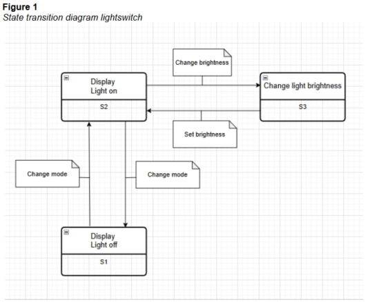

In figure 1 one can identify the following states:
S1: Display: Light off
S2: Display: Light on
S3: Change light brightness

The following events can also be identified:
- Change mode
- Change brightness
- Set brightness

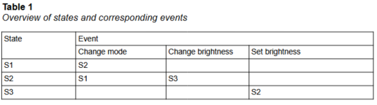

In table 1 I’ve made an overview of the different states and events. Hereby the possible state transitions are made visible. For example you can see that there is a connection between S1 state and the change mode event. Because State S1 cannot directly access the event of “Change brightness” nor “Set brightness” this cell is kept empty.

### State transition diagram with linenumbers
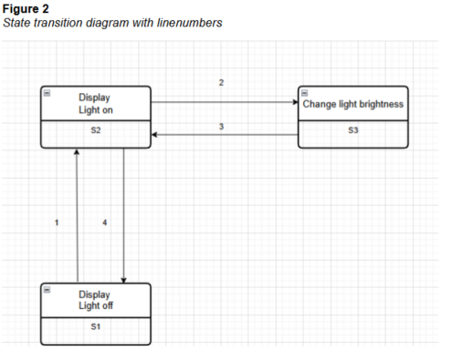

Test situations
Now that we’ve identified the possible states of the lamp device we can now identify the test situations. In table 2 you can find the possible paths based upon 0-switch,1-switch and 2-switch. 

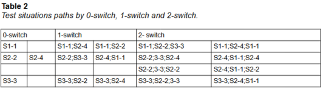

In order to make the appropiate physical testcases I’ve made a testtree which illustrates a clean overview of the possible paths.

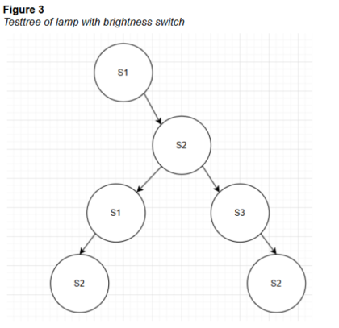

### Physical testcases - N-switch 2

In the tables 3 to 10 you can find the corresponding physical testcases.

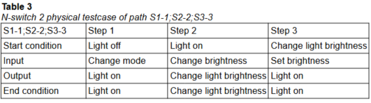

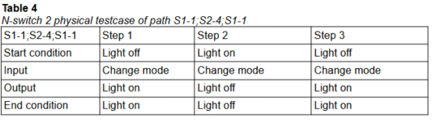

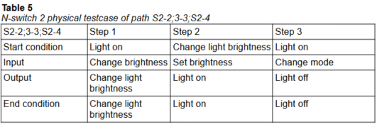

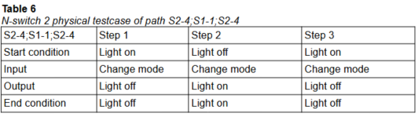

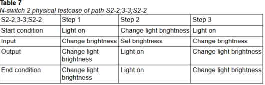

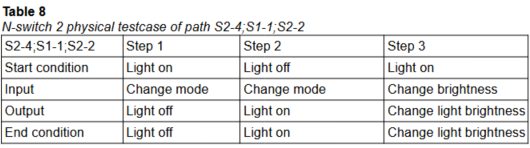

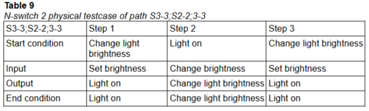

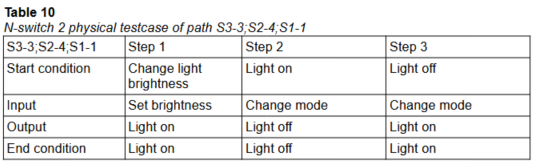

### Acceptance tests with Playwright (Acceptation tests using Playwright)

- The actuals tests can be found in the folder: caselamp.
- Because this is an ongoing project not all the features and steps have been added yet.

### lightswitch feature   
- Tests switching a light on.

```gherkin
Feature: Light switch 
Scenario: Clicking on the light 
    Given User navigates to lightswitchpage
    When I click the light switch
    Then I should see the light turned on at intensity 3

```

### LampPage.spec.js  
- Page Object Model with constructor and common used functions.

```javascript
const {chromium, expect}=require("@playwright/test");
exports.LampPage=class LampPage{
    // Constructor for Page Object Model of the lamppage
    constructor(page,expect){
        this.page=page;
        this.light=this.page.locator("#light");
        this.lightSwitch=this.page.locator("#light-switch");
    }

    // Async function for goto page of lightswitch application
    async goToLampPage(){
        await this.page.goto("http://127.0.0.1:3000/index.html");
    }

    // Async function to click the lightswitch
    async clickLightSwitch(){
        await this.lightSwitch.click();
    }

    // Async function to verify the expected value of the light with the actual value
    async verifyLight_3_is_on(content){
        await expect(content).toEqual("light-three");
        await expect(this.light).toContainClass(content);
    }
    // Async function for taking screenshots and save them in a custom folder with timestamp
    async takeScreenshot(textStep){
        const timestamp=new Date().toISOString().replace(/[:.]/g,'-');
        const screenShotPath=`./tests/tmp/screenshots/${textStep}_${timestamp}.png`;
        await this.page.screenshot({path:screenShotPath});
    }
};

```

### lightswitch.step.js    
- Step definition file

```javascript
const{Given,When, Then,Before, BeforeStep, BeforeAll, After, AfterAll,AfterStep}=require("@cucumber/cucumber");
const{chromium,context}=require("@playwright/test");
const{LampPage}=require("./LampPage.spec");

let browser
let page
let lampPage;

Before(async()=> {
     console.log("Starting browser")
     browser=await chromium.launch({headless:true});
     const context=await browser.newContext();
     page=await context.newPage();
     lampPage=new LampPage(page);
})
BeforeStep(async()=> {
     console.log("Before: Start step")
})
BeforeAll(async()=> {
     // suite level
     console.log("TestSuite Lightswitch - Acceptance Test - Start")
})
After(async()=> {
     // close actions
     console.log("Closing page and browser")
     await page.close()
     await browser.close();
})
AfterStep(async()=> {
     console.log("After: Take screenshot of current step")
     const AfterString="After"
     await lampPage.takeScreenshot(AfterString);
})
AfterAll(async()=> {
     console.log("TestSuite Lightswitch - Acceptance Test - End")
})

Given('User navigates to lightswitchpage', async function(){
     console.log("Given: User navigates to lightswitchpage")
     await lampPage.goToLampPage();
});
When('I click the light switch',async function(){
     console.log("When: I click the light switch")
     lampPage.clickLightSwitch();
});
Then('I should see the light turned on at intensity 3',async function(){
     console.log('Then: I should see the light turned on at intensity 3')
     await lampPage.verifyLight_3_is_on("light-three");   
});

```

The corresponding webapplication can be found in the map: caselamp app

